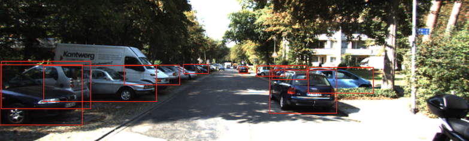
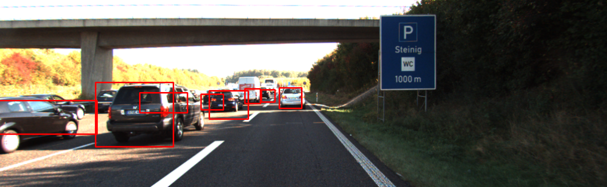

# Car Detection with a Custom Deep Learning Model
### DTSA 5511 Introduction to Deep Learning Final Project — Computer Vision in Autonomous Driving

This repository contains a Jupyter Notebook that demonstrates how to build, train, and evaluate a custom object detection model for identifying cars in images from the KITTI dataset. Unlike approaches that rely on pre-trained architectures (e.g., YOLO, SSD, Faster R-CNN), this project focuses on implementing the core components of an object detection system from scratch, including model architecture, bounding box prediction, and loss functions.

## Project Overview

Modern autonomous vehicles rely on computer vision systems to understand their environment. One of the fundamental tasks in this domain is object detection, which requires:
- Identifying whether specific objects (cars) appear in an image
- Locating those objects by predicting bounding box coordinates

This notebook walks through the complete pipeline required to train such a system on a portion of the KITTI Dataset.
 
| Custom model (after NMS) | Fine-tuned YOLOv8 |
|:---:|:---:|
|  |  |

## Features

- Custom deep learning model built using foundational layers and operations
- Dataset preparation and annotation parsing
- Bounding box regression and object-presence prediction
- Custom loss functions combining classification and localization terms
- Model training workflow
- Visualization of predictions and evaluation results
- Comparison with modern object detection architectures (conceptually)

## Dataset

This project uses the KITTI Object Detection dataset, which contains real-world street-view images captured from sensors mounted on autonomous vehicles.

You can download the dataset from the official website:
[https://www.cvlibs.net/datasets/kitti/](https://www.cvlibs.net/datasets/kitti/)

